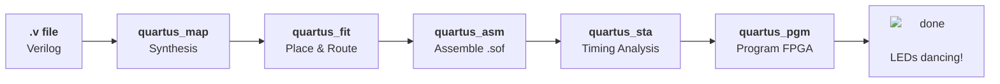
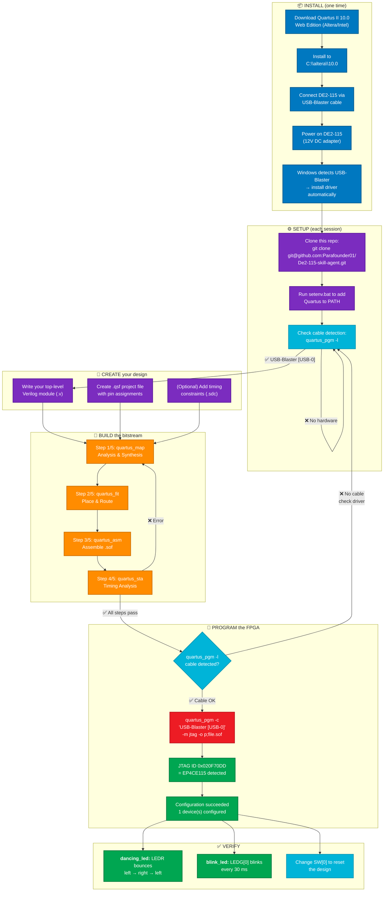

#  DE2-115 Skill Agent — Terasic Cyclone IV FPGA

> **AI skill pack + CLI toolset for the Terasic DE2-115 board**  
> FPGA: Cyclone IV  EP4CE115F29C7  
> Logic Elements: 114,480 &nbsp;|&nbsp; 50 MHz clock  PIN_Y2

---

##  What's Inside

| File | What it does |
|------|-------------|
|  `SKILL.md` | Full AI agent skill — pin tables, workflows, agent prompt |
|  `QUARTUS_CLI.md` | Quartus II 10.0 CLI reference — 20+ commands, error guide |
|  `DE2_115_User_manual.pdf` | Official Terasic manual (14 MB) |
|  `dancing_led.v` | Example: bouncing LED across all 18 red LEDs |
|  `blink_led.qsf` | Reference project file with verified pin assignments |
|  `build_and_program.bat` | One-click build + program script |
|  `setenv.bat` | PATH helper for Quartus CLI |

**npm package** 

| Module | What it does |
|--------|-------------|
|  `package.json` | npm package — install via `npm install .` |
|  `bin/de2-115.mjs` | CLI tool `de2-115` — build, program, scaffold, check |
|  `mcp-server/de2-115-mcp.mjs` | MCP server — AI agents control FPGA via JSON-RPC |
|  `agent-config/` | Skill configs for Mythos Router, opencode, Claude Desktop |
|  `scripts/install-skill.mjs` | Postinstall: auto-copies skill to all AI platforms |

---

##  Install via npm

```bash
git clone git@github.com:Parafounder01/De2-115-skill-agent.git
cd De2-115-skill-agent

# Local install (adds CLI + MCP server + AI skill files)
npm install

# Or globally for the de2-115 CLI command
npm install -g .
```

### What `npm install` does

1. Installs the `@modelcontextprotocol/sdk` dependency
2. Runs `postinstall` → `scripts/install-skill.mjs` which:
   - Copies `SKILL.md` + pin reference to `~/.mythos-router/skills/de2-115/`
   - Copies to `~/.config/opencode/skills/de2-115/`
   - Merges MCP server config into `claude_desktop_config.json`

### Use the CLI

```bash
# Check environment and cable
de2-115 check

# Full build
de2-115 build blink_led

# Program the FPGA
de2-115 program blink_led

# Scaffold a new project
de2-115 project my_design
```

---

##  Step-by-Step: Your First DE2-115 Project

###  Step 1 — Set up the environment

Open a **Command Prompt** (not PowerShell) and run:

```batch
C:\> cd De2-115-skill-agent
C:\De2-115-skill-agent> setenv.bat
```

This adds `C:\altera\10.0\quartus\bin` to your PATH so you can call `quartus_*` commands from anywhere.

>  **Important:** Your Quartus installation must be at `C:\altera\10.0\quartus`. If it's elsewhere, edit `setenv.bat` first.

---

###  Step 2 — Understand the hardware

The DE2-115 has:

| Peripheral | Count | Color |
|-----------|:-----:|-------|
| Red LEDs | 18 |    LEDR[17:0] — active-high |
| Green LEDs | 9 |   LEDG[8:0] — active-high |
| Slide switches | 18 |  SW[17:0] — slide up = logic 1 |
| Push buttons | 4 |  KEY[3:0] — press = logic 0 (active-low!) |
| 7-segment displays | 8 |  HEX0–HEX7 — common-anode, active-low segments |
| 50 MHz clock | 1 |  CLOCK_50 → PIN_Y2 |

---

###  Step 3 — Write your Verilog

Create a top-level module. Here's the `dancing_led` example that bounces a single lit LED across all 18 red LEDs:

```verilog
// dancing_led.v — Bouncing LED across LEDR[17:0]
// clk = 50 MHz (PIN_Y2), rst = SW[0] (PIN_AB28, active-high)
module dancing_led(
    input  wire       clk,
    input  wire       rst,
    output reg [17:0] ledr
);

    reg [24:0] counter;
    localparam HALF_PERIOD = 25'd1_500_000;  // 30 ms step @ 50 MHz

    reg dir;  // 0 = move toward LEDR17, 1 = move toward LEDR0
    localparam TO_HIGH = 1'b0, TO_LOW = 1'b1;

    always @(posedge clk or posedge rst) begin
        if (rst) begin
            counter <= 25'd0;
            ledr    <= 18'h0_0001;  // start at LEDR[0] (rightmost)
            dir     <= TO_HIGH;
        end else begin
            if (counter >= HALF_PERIOD) begin
                counter <= 25'd0;
                if (dir == TO_HIGH) begin
                    if (ledr[17]) begin dir <= TO_LOW;  ledr <= ledr >> 1; end
                    else            ledr <= ledr << 1;
                end else begin
                    if (ledr[0])  begin dir <= TO_HIGH; ledr <= ledr << 1; end
                    else            ledr <= ledr >> 1;
                end
            end else begin
                counter <= counter + 25'd1;
            end
        end
    end

endmodule
```

**What happens:**
-  LEDR[0] lights up first (rightmost)
- Every 30 ms, the lit LED moves one position left
-  When it hits LEDR[17] (leftmost), it reverses direction
-  The LED bounces back and forth forever
- Slide  **SW[0]** up to reset

---

###  Step 4 — Create the Quartus project file

`blink_led.qsf` (the file name defines the project name):

```tcl
# DE2-115 Quartus Settings File
set_global_assignment -name FAMILY "Cyclone IV E"
set_global_assignment -name DEVICE EP4CE115F29C7
set_global_assignment -name TOP_LEVEL_ENTITY dancing_led
set_global_assignment -name PROJECT_OUTPUT_DIRECTORY output_files
set_global_assignment -name SOURCE_FILE dancing_led.v

# Clock — 50 MHz
set_location_assignment -to clk PIN_Y2

# Reset — SW[0] (slide up = logic 1 = reset)
set_location_assignment -to rst PIN_AB28
```

---

###  Step 5 — Build via CLI

Run each step in order:

```batch
:: [1/5] Synthesis: converts Verilog to gate-level netlist
quartus_map  blink_led
```
 `Info: Quartus II Analysis & Synthesis was successful`

```batch
:: [2/5] Fitter: places logic cells and routes connections
quartus_fit  blink_led
```
 `Info: Fitter was successful`

```batch
:: [3/5] Assembler: generates the .sof bitstream
quartus_asm  blink_led
```
 You now have `output_files/blink_led.sof`

```batch
:: [4/5] Timing analysis: checks clock constraints
quartus_sta  blink_led
```
 `Info: TimeQuest Timing Analyzer was successful`

---

###  Step 6 — Program the FPGA

First, check that your USB-Blaster is detected:

```batch
quartus_pgm -l
```
 Expected output: `1) USB-Blaster [USB-0]`

>  If you see `No JTAG hardware available` but `quartus_pgm -c "USB-Blaster [USB-0]"` works, your `jtagd.exe` is missing. This is normal for some Quartus 10.0 copies — `quartus_pgm` opens the cable directly and doesn't need the daemon.

Now program:

```batch
quartus_pgm -c "USB-Blaster [USB-0]" -m jtag -o "p;output_files\blink_led.sof"
```

 `Info: Configuration succeeded -- 1 device(s) configured`

**Your DE2-115 is now running!**   

---

###  Step 7 — Use the one-click script

For subsequent builds, just run:

```batch
build_and_program
```

This runs all 5 steps (map → fit → asm → sta → pgm) in sequence and stops on any error.

---

##  Pin Reference (Color-Coded)

###  LEDR[17:0] — 18 Red LEDs

```
LEDR[0]    PIN_G19   │  LEDR[9]    PIN_G17
LEDR[1]    PIN_F19   │  LEDR[10]   PIN_J15
LEDR[2]    PIN_E19   │  LEDR[11]   PIN_H16
LEDR[3]    PIN_F21   │  LEDR[12]   PIN_J16
LEDR[4]    PIN_F18   │  LEDR[13]   PIN_H17
LEDR[5]    PIN_E18   │  LEDR[14]   PIN_F15
LEDR[6]    PIN_J19   │  LEDR[15]   PIN_G15
LEDR[7]    PIN_H19   │  LEDR[16]   PIN_G16
LEDR[8]    PIN_J17   │  LEDR[17]   PIN_H15
```

###  LEDG[8:0] — 9 Green LEDs

```
LEDG[0]    PIN_E21   │  LEDG[5]    PIN_G20
LEDG[1]    PIN_E22   │  LEDG[6]    PIN_G22
LEDG[2]    PIN_E25   │  LEDG[7]    PIN_G21
LEDG[3]    PIN_E24   │  LEDG[8]    PIN_F17
LEDG[4]    PIN_H21   │
```

###  SW[17:0] — 18 Slide Switches

```
SW[0]   PIN_AB28   │  SW[6]   PIN_AD26   │  SW[12]  PIN_AB23
SW[1]   PIN_AC28   │  SW[7]   PIN_AB26   │  SW[13]  PIN_AA24
SW[2]   PIN_AC27   │  SW[8]   PIN_AC25   │  SW[14]  PIN_AA23
SW[3]   PIN_AD27   │  SW[9]   PIN_AB25   │  SW[15]  PIN_AA22
SW[4]   PIN_AB27   │  SW[10]  PIN_AC24   │  SW[16]  PIN_Y24
SW[5]   PIN_AC26   │  SW[11]  PIN_AB24   │  SW[17]  PIN_Y23
```

>  Slide **up** (toward the LEDs) = logic `1` in the FPGA. Slide **down** = logic `0`.

###  KEY[3:0] — 4 Push Buttons

```
KEY[0]  PIN_M23   │  KEY[2]  PIN_N21
KEY[1]  PIN_M21   │  KEY[3]  PIN_R24
```

>  **KEYs are active-low!** Pressed = logic `0`, released = logic `1`.  
> They have internal pull-up resistors, so they default to `1` when not pressed.

###  HEX[7:0] — 8 Seven-Segment Displays

Each display uses 7 segments (a,b,c,d,e,f,g) plus a decimal point (dp):

```
    a
   ───
f │   │ b
   ─ g
e │   │ c
   ───
    d     dp
```

**Segment-to-pin mapping (HEX0 example):**

| Segment | FPGA Pin |
|---------|----------|
| a (HEX0[0]) | PIN_G18 |
| b (HEX0[1]) | PIN_F22 |
| c (HEX0[2]) | PIN_E17 |
| d (HEX0[3]) | PIN_L26 |
| e (HEX0[4]) | PIN_L25 |
| f (HEX0[5]) | PIN_J22 |
| g (HEX0[6]) | PIN_H22 |

**Segment encoding** (7-bit, **active-low** — clear bit = segment on, set bit = segment off):
```
Number 0:  7'b1000000    Number 5:  7'b0010010
Number 1:  7'b1111001    Number 6:  7'b0000010
Number 2:  7'b0100100    Number 7:  7'b1111000
Number 3:  7'b0110000    Number 8:  7'b0000000
Number 4:  7'b0011001    Number 9:  7'b0010000
```

---

##  One-Command Build Script Explained

`build_and_program.bat` does this:



If any step fails, the script stops immediately (via `|| goto :fail`).

**Key details:**
-  The `.sof` is generated in `output_files/` (controlled by `PROJECT_OUTPUT_DIRECTORY` in the `.qsf`)
-  `quartus_pgm -l` uses a **single dash** in Quartus 10.0 (not `--l`)
-  Cable name is almost always `"USB-Blaster [USB-0]"`

---

---

##  MCP Server — AI Agents Control the DE2-115

The MCP server (`mcp-server/de2-115-mcp.mjs`) lets AI agents (Claude Desktop, Mythos Router, opencode) interact with your FPGA in real time via the [Model Context Protocol](https://modelcontextprotocol.io).

### Connect from Claude Desktop

Add this to your `claude_desktop_config.json`:

```json
{
  "mcpServers": {
    "de2-115": {
      "command": "node",
      "args": ["C:\\path\\to\\De2-115-skill-agent\\mcp-server\\de2-115-mcp.mjs"],
      "env": {}
    }
  }
}
```

Or use the auto-merge config from `npm install` (see above).

### Tools the AI gets

| Tool | What the AI can ask |
|------|-------------------|
| `build_project` | "Compile the blink_led project" |
| `program_fpga` | "Program the DE2-115 with my design" |
| `list_cables` | "Is the USB-Blaster connected?" |
| `scaffold_project` | "Create a new project called my_audio_dsp" |
| `read_pin_status` | "What pins does blink_led use?" |

### Resources the AI can read

| URI | Content |
|-----|---------|
| `de2-115://board/specs` | Full board specifications |
| `de2-115://pinout/ledr` | LEDR[17:0] pin table |
| `de2-115://pinout/ledg` | LEDG[8:0] pin table |
| `de2-115://pinout/sw` | SW[17:0] pin table |
| `de2-115://project/{name}/sof` | `.sof` file status |

### Start manually

```bash
node mcp-server/de2-115-mcp.mjs
```

The server listens on stdin/stdout for JSON-RPC 2.0 messages conforming to the MCP spec.

---

##  Full Installation & Workflow Diagram



---

##  Troubleshooting

| Problem  | Cause  | Fix  |
|---------|-------|-----|
| `Illegal location assignment PIN_J2` | Wrong pin — J2 is a dedicated config pin | Use the correct pin from the tables above |
| `Unknown long option --l` | Used `--l` instead of `-l` | Change to `quartus_pgm -l` |
| `No JTAG hardware available` | `jtagd.exe` missing from Quartus 10.0 | Ignore it — `quartus_pgm -c "USB-Blaster [USB-0]"` still works |
| `Can't fit design in device` | Too many resources or illegal pin | Check pins, reduce logic |
| `Timing requirements not met` | No clock constraint (.sdc) | Benign for simple designs. Add `.sdc` if needed |
| Device not detected by `quartus_pgm -l` | Driver issue on Windows 11 | Use Quartus Prime driver (signed) — `quartus_pgm` opens cable directly |

---

##  Loading as an AI Agent Skill

Tell your AI agent:

> Load skill: de2-115-skill-agent  
> Reference: SKILL.md for pin tables + QUARTUS_CLI.md for commands  
> Board: DE2-115 (Cyclone IV EP4CE115F29C7), 50 MHz, 18 red LEDs, 9 green LEDs  
> Workflow: map → fit → asm → sta → pgm via Quartus II 10.0 CLI

---

##  License

Reference material (pin assignments, manual) copyright © Terasic Technologies Inc.  
Tool scripts and documentation provided as-is for AI-assisted DE2-115 development.

---

<p align="center">


<br/>
<strong>DE2-115 Skill Agent</strong> — Built for the <a href="https://www.terasic.com.tw">Terasic</a> DE2-115 FPGA Board
</p>
